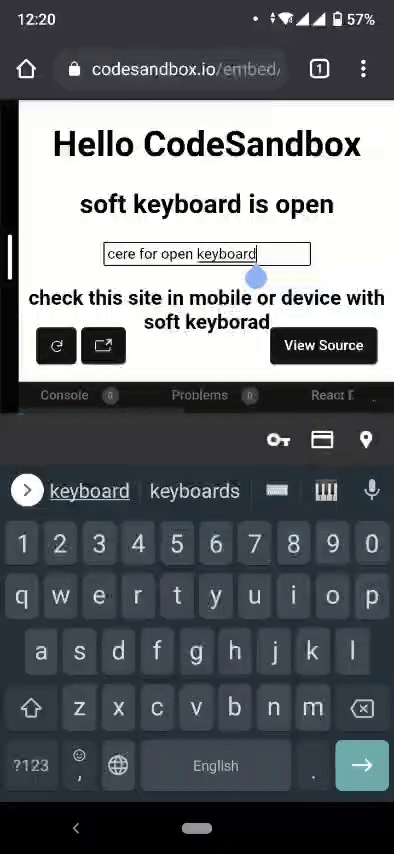

# use-detect-keyboard-open #


### sandbox
[](https://codesandbox.io/s/smoosh-water-ysj3w?fontsize=14&hidenavigation=1&theme=dark)
### install
`yarn add use-detect-keyboard-open`

or

`npm i use-detect-keyboard-open`

### **See it in Action** ###

<center>

</center>

### example

```
import useDetectKeyboardOpen from "use-detect-keyboard-open";
export default function App() {
  const isKeyboardOpen = useDetectKeyboardOpen();
  return (
    <div>
      <h2>{`soft keyboard is ${isKeyboardOpen ? "open" : "close"}`}</h2>
      <input defaultValue="click here for open keyboard" />
    </div>
  );
}
```
### options

useDetectKeyboardOpen( minKeyboardHighte , defalutValue )

- defalutValue : boolean 
    - for initial value 
    - default null
    - optional
- minKeyboardHighte : number
    - for minimom hight of keyboard for detect is open
    - default 300
    - optional


